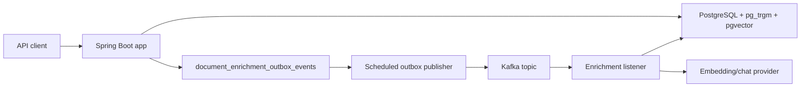

# WealthTech Search API

Backend service for the Nevis WealthTech home task. It lets advisors create clients, attach documents to those clients, and search across both client metadata and document content through one API.

The implementation uses Spring Boot and Java, PostgreSQL with `pg_trgm` and `pgvector`, Kafka, and Spring AI embedding/chat providers. Client search is lexical and fuzzy; document search is semantic and powered by embeddings. Document summaries are generated asynchronously.

## Requirement Match

| Task requirement | Implementation                                                                       |
| --- |--------------------------------------------------------------------------------------|
| `POST /clients` with `first_name`, `last_name`, `email`, optional `description`, `social_links` | Implemented. `social_links` is exposed as `array<string>` to match the requirements. |
| `POST /clients/{id}/documents` with `title`, `content` | Implemented. Returns `201` and enqueues summary/chunking jobs.                       |
| `GET /search?q=...` | Implemented. Searches clients and documents in parallel.                             |
| Client search over email/name/description | Implemented with PostgreSQL trigram similarity and prefix matching.                  |
| Document search by similar terms | Implemented with embeddings stored in `pgvector`.                                    |
| Optional quick summary | Implemented as an asynchronous document enrichment job.                              |
| Docker Compose reproducibility | `docker-compose.yml` starts PostgreSQL, Kafka, and the app.                          |
| Tests for core logic and edge cases | Unit, integration, and black-box e2e test suites are included.                       |
| README with setup and examples | This file.                                                                           |
| API documentation | `wealth-tech-openapi.yaml`.                                                          |

## Architecture



Core flows:

- Client creation stores the client and social links in PostgreSQL.
- Document creation stores the raw document, then inserts two outbox jobs: `SUMMARY` and `CHUNKING`.
- The outbox publisher locks pending jobs and publishes them to Kafka.
- Kafka consumers generate summaries and document chunks/embeddings.
- Summaries are eventually consistent: the document is returned immediately after creation, but `summary` may be `null` until the `SUMMARY` job finishes.
- Search runs client search and document search concurrently with bounded virtual threads.
- The response keeps `clients`, `documents`, and `errors` separate because lexical scores and embedding scores are not directly comparable.

## Idempotency

Enrichment processing is designed to tolerate retries and redelivery. Kafka event ids are recorded in `document_enrichment_processed_events`, so a redelivered event is skipped after it has already been processed successfully.

Chunk storage is idempotent per document and chunk index. The database enforces a unique `(document_id, chunk_index)` constraint, and chunk writes use `ON CONFLICT ... DO UPDATE` to refresh the stored content and embedding for the same chunk position.

Outbox publishing is also retry-friendly: pending events are locked before publishing, failed publishes are returned to `PENDING` with backoff, and stale `PROCESSING` locks can be claimed again after the lock timeout.

## Tradeoffs

### Simplicity vs Production-Like Architecture

This is a single Spring Boot application rather than a set of microservices. That makes the project easier to run, test, explain, and review in a home-task setting. It also keeps infrastructure and operational overhead low, which lets the implementation focus on the actual search and enrichment behavior.

The cost is that components cannot scale independently and responsibilities are less isolated than they would be in a larger distributed system. A natural production evolution would be to split document enrichment workers into separate services if indexing or summary generation load grows faster than API traffic.

### PostgreSQL + pgvector vs Elasticsearch/OpenSearch

PostgreSQL is used for relational storage, fuzzy client search, and vector-based document search. For the expected MVP scale, PostgreSQL + `pgvector` keeps the system operationally simpler while still supporting the semantic search requirement. It also gives one storage system, a simpler Docker Compose setup, easier transactional consistency, and easier tests.

The tradeoff is that this service does not get advanced search features out of the box, such as BM25-style ranking, highlighting, hybrid ranking pipelines, and richer search analytics. If those become product requirements, search can be revisited without changing the public API shape.

### Embeddings vs Classic Keyword Search

Document search uses embeddings because the requirement asks for semantic matching, such as finding a document containing "utility bill" when the user searches for "address proof". Embeddings usually produce better semantic relevance than plain keyword or trigram matching for this kind of query.

The cost is that embeddings must be generated, stored, and kept up to date. That adds latency, background processing, and model dependency. Alternatives considered for future improvement include PostgreSQL full-text search, `pg_trgm`, synonyms, or a hybrid lexical-plus-vector ranking flow.

### Hosted vs Local Embedding Providers

This implementation uses Spring AI with a hosted embedding/chat provider. That gives a straightforward model path and good semantic quality without running local model infrastructure.

The tradeoff is an external dependency, network latency, and usage cost. A local provider would be cheaper and more self-contained for offline demos, but would add local model setup, usually run slower, and depend heavily on the selected local model quality.

### One Active Embedding Model vs Multi-Model Support

The schema assumes one active embedding model per deployment/index. That keeps the vector column, index, query code, and migrations simple.

Switching embedding models may require re-embedding existing document chunks, especially if vector dimensions or similarity behavior change. Supporting multiple models side by side would require model metadata and separate vector indexes or tables.

### Chunking vs Embedding the Whole Document

Documents are split into chunks before embedding. Chunking improves search quality for longer documents because the system can match a focused part of the document instead of averaging unrelated content into one vector. It also lets the API return `matched_chunk`, which explains why a document matched.

The tradeoff is more rows, more embeddings to generate, and more storage. For a search API, that extra complexity is worth it because snippet-level matches are more useful than whole-document-only matches.

### Transactional Outbox vs Direct Kafka Publish

Document creation writes enrichment events into `document_enrichment_outbox_events` in the same transaction as the document. A scheduled publisher then sends pending events to Kafka and marks them as published. This avoids the classic direct-publish failure case where a document is saved but its enrichment event is lost.

The outbox adds some repository, scheduling, and retry code, but it is worth the clarity for this workflow. Processors are idempotent and processed event ids are recorded to make retries safe.

### One Job Per Enrichment Action

The service creates separate enrichment actions for `SUMMARY` and `CHUNKING`. That means summary generation can fail or retry independently from semantic indexing.

This improves parallelism and future extensibility, because adding another enrichment type does not require reshaping a single large job. The cost is more events to track and more operational state to monitor.

### Summary Stored on Documents vs Separate Table

The generated summary is stored directly in `documents.summary`. That is simple because the summary belongs to the document as a whole and can be returned without an extra join or API call.

The summary is eventually consistent. `POST /clients/{id}/documents` returns as soon as the document and enrichment jobs are stored, so immediate reads and early search responses may show `summary: null`. Once the `SUMMARY` job succeeds, later document reads and search previews include the generated summary.

A separate summary table would be more flexible for model-specific, versioned, or multi-language summaries. For this task, the direct column keeps the API and persistence model easier to understand.

### Grouped Search Response vs Mixed List

The task `/search` enpoint as an array, but the implementation returns grouped results:

```json
{
  "clients": [],
  "documents": []
}
```

This is intentional because client and document scores are not directly comparable. Grouping gives simpler API semantics, easier UI handling, and avoids pretending there is one global ranking feed across different result types.

### Returning Previews vs IDs Only

Search returns lightweight previews instead of only IDs. Client results include the useful client fields, and document results include `id`, `client_id`, `title`, `summary`, `matched_chunk`, and `score`.

This makes search results immediately useful and avoids excessive follow-up requests. `matched_chunk` also explains why a document matched. The tradeoff is a larger payload than an ID-only response.

### Preview-Only Search vs Full Document Content

Search results do not include full document content. That keeps the search API lightweight and avoids returning large document bodies in every result.

If the user needs the full document, it can be fetched separately with `GET /clients/{clientId}/documents/{documentId}`. This requires an additional request, but keeps normal search responses smaller and faster.

### Including Scores vs Hiding Scores

The API includes relevance scores. Scores make debugging, ranking evaluation, and relevance tuning easier.

They are implementation-specific and should not be treated as stable business metrics. A future API could document score semantics more formally or hide scores from end-user-facing clients.

### Partial Results vs Failing the Whole Search

The search facade runs client and document search independently and returns partial results with warnings if one source fails. For example, client search can still work if semantic document search is temporarily unavailable.

This improves availability and graceful degradation. The tradeoff is a slightly more complex response because callers must check the `errors` array.

### Top-K Limits vs Pagination

The API uses `client_limit` and `document_limit` instead of offset pagination. This is simpler and fits common semantic search behavior, where users usually want the best few matches rather than deep browsing.

The tradeoff is that it is not designed for browsing very large result sets. If that becomes a product requirement, search would need cursoring and filtering.

## Prerequisites

- Docker and Docker Compose.
- JDK 25 if running the app directly instead of through Docker.
- An API key for the configured embedding/chat provider in a real run. The current local configuration reads it from `OPENAI_API_KEY`.

Create a local environment file:

```bash
cp .env.example .env
```

Then edit `.env` and set `OPENAI_API_KEY`.

The service uses OpenAI through Spring AI:

- Embeddings: `text-embedding-3-small` with `dimensions: 1536`.
- Chat/document summaries: `gpt-5-nano`.

Embedding requests explicitly set the vector length to `1536`, matching the PostgreSQL `VECTOR(1536)` column used for document chunk search.

## Run With Docker Compose

Start everything:

```bash
docker compose up --build
```

The app listens on `http://localhost:8080`. Actuator listens on `http://localhost:8081`.

If your machine uses the legacy binary, run:

```bash
docker-compose up --build
```

To start from a fresh PostgreSQL volume and import the included backup:

```bash
make COMPOSE="docker compose" up-fresh-with-backup
```

Stop the stack:

```bash
docker compose down
```

Remove the database volume too:

```bash
docker compose down -v
```

## Run Locally

Start dependencies:

```bash
docker compose up -d postgres kafka
```

Run the app:

```bash
export OPENAI_API_KEY=your-key
./gradlew bootRun
```

## API Examples

Create a client:

```bash
curl -s -X POST http://localhost:8080/clients \
  -H 'Content-Type: application/json' \
  -d '{
    "first_name": "John",
    "last_name": "Doe",
    "email": "john.doe@neviswealth.com",
    "description": "High net worth individual interested in tech stocks and real estate.",
    "social_links": ["https://linkedin.com/in/johndoe"]
  }'
```

Create a document for that client:

```bash
curl -s -X POST http://localhost:8080/clients/6d7cc828-8fb3-4efe-ae9c-523d14df21fa/documents \
  -H 'Content-Type: application/json' \
  -d '{
    "title": "Address verification",
    "content": "Utility bill confirming the client address and residency."
  }'
```

Semantic search:

```bash
curl -s 'http://localhost:8080/search?q=address%20proof'
```

Example response:

```json
{
  "query": "address proof",
  "clients": [
    {
      "id": "6d7cc828-8fb3-4efe-ae9c-523d14df21fa",
      "first_name": "John",
      "last_name": "Doe",
      "email": "john.doe@neviswealth.com",
      "description": "High net worth individual interested in tech stocks and real estate.",
      "social_links": ["https://linkedin.com/in/johndoe"],
      "score": 0.73
    }
  ],
  "documents": [
    {
      "id": "4f1ff25c-f514-42d6-8f1f-881b7de80928",
      "client_id": "6d7cc828-8fb3-4efe-ae9c-523d14df21fa",
      "score": 0.86,
      "title": "Address verification",
      "summary": "Utility bill confirming the client's address and residency.",
      "matched_chunk": "Utility bill confirming the client address and residency."
    }
  ],
  "errors": []
}
```

The document example may need a short wait after creation because embedding generation and summary generation are asynchronous. Until the `SUMMARY` job completes, document and search responses can contain `summary: null`; this is expected eventual consistency rather than a failed create request.

## Tests

Run unit tests:

```bash
./gradlew test
```

Run integration tests. These use Testcontainers PostgreSQL and embedded Kafka, and mock the AI clients:

```bash
./gradlew integrationTest
```

Run black-box e2e tests against a running app:

```bash
./gradlew e2eTest -Pe2e.baseUrl=http://localhost:8080
```

The e2e suite waits for actuator health on port `8081` by default. Override it with `-Pe2e.managementBaseUrl=http://host:8081` or `E2E_MANAGEMENT_BASE_URL` when needed.


## Monitoring

Health:

```bash
curl -s http://localhost:8081/actuator/health
```

Metric discovery:

```bash
curl -s http://localhost:8081/actuator/metrics
```

Useful custom metrics:

```bash
curl -s http://localhost:8081/actuator/metrics/search.task.duration
curl -s http://localhost:8081/actuator/metrics/search.executor.tasks.running
curl -s http://localhost:8081/actuator/metrics/search.executor.tasks.available
curl -s http://localhost:8081/actuator/metrics/document.enrichment.outbox.events
curl -s http://localhost:8081/actuator/metrics/document.enrichment.event.duration
```

Operational checks:

- App logs: `docker compose logs -f app`
- Kafka logs: `docker compose logs -f kafka`
- PostgreSQL logs: `docker compose logs -f postgres`
- Failed enrichment messages go to `document-enrichment-events-dlt`.
- Pending outbox volume is visible through the `document.enrichment.outbox.events` metric.
- If summaries stay `null` for newly created documents, check pending/failed `SUMMARY` outbox events, Kafka consumer logs, embedding/chat provider errors, and the DLT.

## Future Scaling Considerations

The HTTP layer is mostly stateless, so the simplest scaling path is to run multiple app instances behind a load balancer while sharing PostgreSQL and Kafka. Outbox polling uses row locking, Kafka distributes enrichment work across the consumer group, and processed event ids make redelivery safe.

The main tuning knobs are `search.pool-size`, `search.client-timeout-ms`, `search.document-timeout-ms`, `enrichment.scheduler.batch-size`, `enrichment.scheduler.fixed-delay-ms`, `enrichment.kafka.consumer.concurrency`, Kafka partitions, and the PostgreSQL connection pool. Increase these carefully together: more app replicas or consumer threads can improve throughput, but they also increase database and embedding-provider pressure.

Today the same application process serves API traffic and runs enrichment workers. That is fine for this MVP; if load grows, API and worker deployments can be separated so search traffic and background enrichment scale independently.

## Next System Evaluation

The next evaluation should stay practical and repeatable. It should cover correctness testing for the API and enrichment retries, search relevance validation against a small golden dataset, `/search` latency measurements at p50/p95/p99, and resilience testing around temporary Kafka or embedding-provider failures.

## Project Layout

- `src/main/java/.../rest`: HTTP endpoints, DTOs, request validation, response mapping.
- `src/main/java/.../service/search`: client/document search orchestration and metrics.
- `src/main/java/.../service/enrichment`: document summary/chunking outbox, Kafka listener, processors, metrics.
- `src/main/java/.../persistence`: Spring Data JDBC entities, projections, and SQL repositories.
- `src/main/resources/schema.sql`: PostgreSQL schema, extensions, and indexes.
- `wealth-tech-openapi.yaml`: API documentation.
- `http`: local HTTP client examples.
- `e2e-tests`: black-box TestNG/RestAssured tests.
- `backups`: optional seed backup import for local compose runs.

## Known Limitations

- Schema management is a single `schema.sql` file rather than versioned migrations.
- Semantic search depends on enrichment completing successfully; raw documents are still retrievable immediately.
- Document summaries are eventually consistent and may be `null` until asynchronous enrichment completes.
- API endpoints and enrichment workers currently run in the same application process, so they scale together until split into separate deployments.
